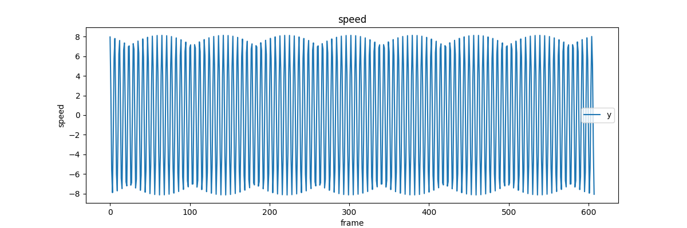

# opencv 考核题

## 旋转预测
### 思路
原本打算使用kalman滤波，但是估计需要先设一个状态方程，我在这方面能力有限，估计要后面再弄。

我现在的想法是根据输出的正弦函数图像手动确定一个周期，然后拟合这个周期的图像。

接着，我打算根据当前速度的趋势确定在函数中的位置，计算60帧的积分得到一个路程。

`路程/半径`转换成弧度，接着根据弧度画出预测矩形框。

后来我放弃了拟合，为什么，因为算力不够，效果也不好。

但凡它效果好一些，我就间隔15帧左右拟合一次，然后根据拟合的结果进行预测。

现在是采用了平滑一个周期的字典来当作“函数”进行积分。

大体上已经完成了，但是预测结果还有一些抖动，打算再看看

