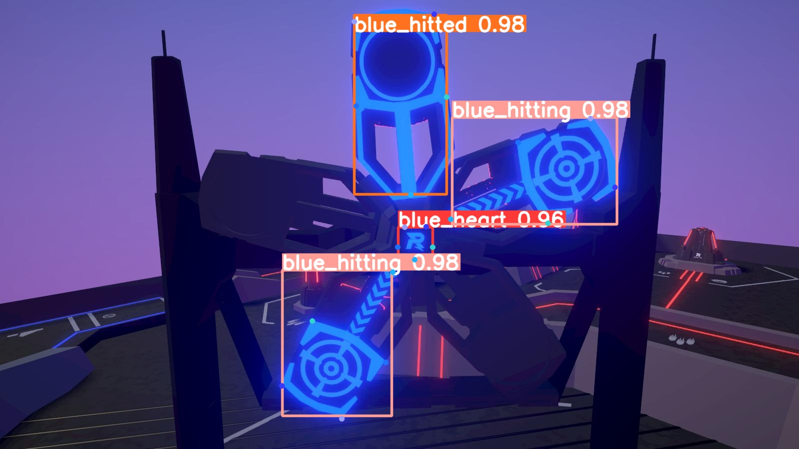

# RM第二轮考核——能量机关识别部分记录

任务分析：针对一个规定了亮度、目标位置的2000多张图像的数据集，很容易就过拟合了。但推理视频也是同样的参数，那么确实也可以认为满足独立同分布的假设，但泛化性能不会好。因此主要是考察能不能照着教程做。

## yolov8部分记录

### 1 数据集准备

使用编写的脚本对直接下载下来的数据集进行了划分。

脚本位置：`YOLOv8/convert_dataset.py`

### 2 本地测试配置文件（避免上云后配置不对浪费钱）

在本地进行测试的时候，通过源码安装。这样有助于对配置文件的修改和熟悉代码结构。

#### 2.1 提前下载预训练模型

由于我将要使用的是北京超算（非常十分很不方便，可是我白嫖的算力不多了，勉强用用），训练过程中不能联网，所以需要提前下载预训练模型，指定路径。在官网下载`yolov8n-pose.pt`。

#### 2.2 改写配置文件：coco-pose.yaml

用`coco-pose.yaml`这个配置文件，因为要进行关键点检测。

#### 2.3 进行训练

这个时候我出现了一个失误，没有删除缓存。因为之前用单纯的目标检测试了一次，所以train和val目录下依然有缓存。在进行关键点检测的训练的时候，由于train和val目录下已经存在缓存，它就不重新读取数据了，导致没有读取到配置文件中所写的关键点。找了一会儿才发现原因。

本地测试只进行1个epoch。

使用的本地测试的命令是

```shell
yolo train model=/home/zhaofake/mmlab/ultralytics/ultralytics/data/scripts/weights/yolov8n-pose.pt data=coco-pose.yaml epochs=1
```

这里，yolov8可以通过指定model=权重来表达：1 使用的模型；2 使用预训练权重。

这个语句也可以表达为model=model定义配置文件 pretrain=所使用的预训练权重。在这里，由于yolov8的相对路径关系很迷，有一些没有暴露的根目录，yaml又没有docstring可以看，我使用了一个绝对路径来指定权重。

在本地测试，可以成功运行，遂上传数据到云平台。

### 3 在云平台上进行训练

#### 3.1 安装

由于配置文件和权重都已经准备好了 ，所以使用pip进行`ultralytics`包的安装。

#### 3.2 关于调参

由于这实际上并不是一个算法竞赛，所以把大量时间花在优化参数来提高置信度上是理由不够充分且不经济的。

我认为更应该的是减少对结果质量影响的前提下缩短训练所需的时间，从而节省经费。

这里面最主要的是对`batch_size`和`num_workers`的调整。`ultralytics`默认的bs是16，我在北京超算上使用的GPU是tesla V100，因此我可以将bs适当调大。可以先通过运行一个epoch来看占用的显存和gpu使用率。然后增大bs和workers。这里我将bs调整为64。这是通过命令行参数来实现的，并没有表现在代码中，具体的运行命令见下文。

从我训练一次的结果来看（如下图），在目标检测上它已经可以做到hitting置信度达到0.9，r标置信度达到0.8，只有hitting标的置信度在0.28，但是目标识别依然十分容易；但关键点检测方面那就是一塌糊涂了。因此我认为并不需要200个epoch。或者说，即使需要200个epoch，也不需要一次训练完。我们完全可以第一次只训练100个甚至50个、20个epoch，根据实际的结果来决定是否继续进行训练，只需要将上一次的训练结果作为这一次的预训练权重即可。

**很遗憾地说，我那个只训练了一次的权重推理得到的图片我找不到了，总之就是置信度已经蛮高的了。**

另一个可以进行常用的可调整的参数是lr学习率。默认的学习率是0.001，其实是有些小了。下降太慢，如果调到0.01甚至0.1的话可以大大减少训练的轮次，但lr过大可能导致欠拟合。但是在训练之前我不能够确定，所以没有动这个参数。如果是自己来确定学习率的话，一种常用的做法是根据训练指标比如损失函数动态调节学习率或者更具训练轮数调整学习率，比如100轮后学习率改为当前学习率的十分之一。

通过上述方式，我们可以大大节省训练所需的时间成本和经费。

<mark>
前几天观看了东北大学的能量机关识别分享。很有收获。</br>特别是他们关于“过拟合”的一些看法让我明显感受到了我在面对实际应用问题时的考虑是不够的。</br>确实，面对能量机关识别这种任务，比较强的泛化能力恰恰是非必须的，我减小训练的epoch避免过拟合（其实现在应该也是一种过拟合的状态，只是没有在别的东西上尝试），是不必要的；高置信度恰恰是需要的。与其考虑过拟合的问题，不如考虑如何简化网络，减小参数量，加快推理速度。
</mark>

#### 3.4 训练

因为北京超算只能提交.sh脚本，所以要写一个。下面的最后一行就是我使用的训练命令及参数。

```bash
#!/bin/bash
module load anaconda/2020.11
module load  cuda/11.2
source activate kewu
export PYTHONUNBUFFERED=1
cd /data/home/scv8748/run/work_dirs
yolo pose train data=coco-pose.yaml model=yolov8n-pose.pt epochs=50 batch=64 device=0
```

训练完成后查看日志，并下载权重到本地评估这个权重的效果。

日志的位置在作业文件夹中`YOLOv8`下的`log.out`文件中，可使用记事本打开。

通过对配置文件的观察，首先可以判断出，在训练了50个epoch后，置信度已经达到的相当高的水准。并且，从损失函数的变化趋势来看，此模型的损失函数还可以进一步降低。但已经没有必要了，过犹不及，在这样的一个分布的数据集上达到再高的置信度也是没有用的，或者说越高越没有用，它对于现实的数据无疑是过拟合的。若继续训练，模型会变得更复杂，推理速度会降低，用处也不会变大，不经济；其次，我的bs还是设的保守了些，可以再翻一倍，这样训练的时长也会降低，进一步解决经费。

然后回到本地对一张图片进行推理，命令为

```shell
yolo pose predict model=/home/zhaofake/mmlab/ultralytics/runs/pose/train2/weights/last.pt source="/home/zhaofake/mmlab/ultralytics/ultralytics/data/dafu_dataset/test/images/2023_8_8_12_43_45_950.jpg"
```

结果是



从结果来看，虽然损失函数还可以进一步降低，但是实在是没有必要了。权重的大小仅6MB，我的11代i5上单张图片推理速度在30~60ms波动，这也是因为数据集分布简单，不需要太多参数的原因。

更多对结果的指标与可解释性分析在`YOLOv8`文件夹下的train2压缩包中。

### 考核指标

#### 指标一

推理后的视频在`YOLOv8`文件夹中，原本是avi格式，但是图像有200多兆。尽管可以用`git-lfs`传输大文件，但也是有容量限制的，因此还是转换一下格式比较好。转换为mp4格式后成功压缩到70mb。格式转换脚本也在文件夹中。

#### 指标二

自己区分数据集的脚本，在文件夹`YOLOv8`中。

### 一点补充

前两天群里对yolov5和yolov5face的一些区别进行了小范围讨论。yolov5face是目标检测任务，但是不是纯粹的目标检测任务，是使用了关键点回归的，是带有关键点信息的目标检测任务。我想这也就是几个同学在使用ultralytics时检测框出现问题的原因。因为针对pose任务和detect任务的数据增强策略是不一样的。应该是在detect任务的数据增强过程中对标注框同样进行了变换。


