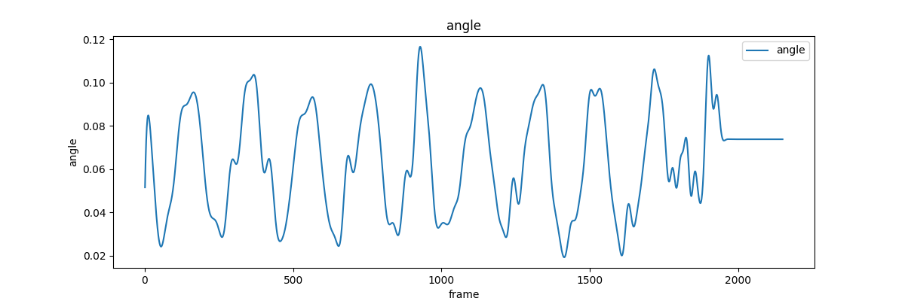
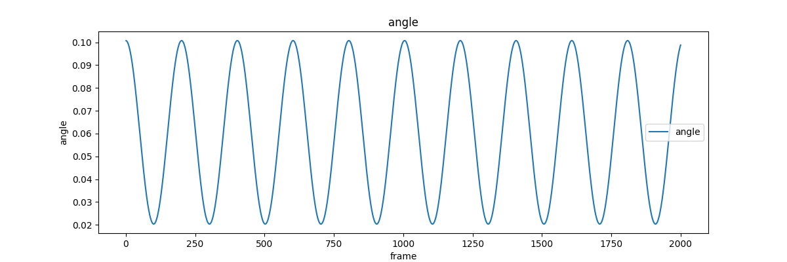

# opencv 考核题

@[TOC](opencv考核题)

## 文件结构

```shell
Folder_4_Opencv
├── code
│   ├── 20230828104307.txt
│   ├── main.py
│   ├── poetry.lock
│   ├── predict.py
│   ├── prepross.py
│   ├── __pycache__
│   │   ├── predict.cpython-310.pyc
│   │   └── prepross.cpython-310.pyc
│   └── pyproject.toml
├── img
│   ├── 测得角速度.png
│   └── 拟合函数.png
├── README.md
└── video
    ├── blue_dark.mp4
    └── opencv试题调试录屏.webm
```
其中的_pycache_文件夹在上传时会去除。

## 旋转预测所需提交

由于我基本完成了旋转预测，所以按照题意，有如下需要提交的文件
**角速度的图像**

此外，我也绘制了所得的拟合函数的图像，一同附上便于对照

此外，所使用的<mark>测试视频</mark>以及<mark>调试录像</mark>都在文件夹`video`中。

## 其他说明

1. 使用环境管理工具poetry，并且一同提交了toml文件，便于得到相同的环境（但是非必需的）
2. 在`main.py`中，末尾有两段绘图相关的注释掉的代码段，分别是绘制角速度和预测函数的。
3. 在`predict.py`中，由于对周期的计算还有一些问题，所以姑且在`predict()`函数中将`period`取为201，但依然保留了计算周期的部分，可以将`period = 201`注释掉获得计算出的周期拟合的结果。
4. 关于输出要求，即判断方向、得到主要计算部分耗时、预测矩形框的位置等，均将其写入以时间命令的日志文件，日志文件会产生在`code`的同级文件夹下。目前的计算耗时在我本地（不绘制图像的情况下），在5到8毫秒之间。

## 思路解释

首先需要意识到测试视频的一个重要特点，它是60帧的视频，但是实际上每两帧都是相同的，应该是30帧的摄像头拍摄的。也就是说，预测一秒本来应该是算60帧之后，但是如果我的速度是采用帧间差分得到的，那么就只能积30个速度（因为帧间差分得到的角速度单位应该是`rad/2帧` ）

也许有必要说明为什么是`rad/2帧` 来表明我确实认识到了。
如果使用的是每一帧都积分，那么获得的就是0和非0间隔的角速度，在对角速度列表处理之后，0被我（相信也是大多数情况的做法）作为异常值剔除，那么实际得到的就是每两帧的角度差；如果是间隔一帧的差分，那么得到的依然是每两帧的角度差。

### 获取图像中心与待击打装甲板

先进行预处理（这一部分比较通用，在代码注释中也有体现，故略写），然后对面积最小的矩形框判断为中心的灯条，对设定面积大于100时的最小矩形狂判断为待击打装甲板。

### 获取角速度

之后，灯条矩形框比较稳定，我将其长边所指的方向作为`cen_arrow`，意思是“中心箭头”，用于测得角速度；这里使用待击打装甲板也同样可以获得角速度，但是由于装甲板会发生变化，不如`cen_arrow`稳定——尽管同样可以依靠对角速度列表的处理，比如平滑或者低通滤波以及去除非正值和过大值等异常值来减小甚至消除这些影响，但是既然`cen_arrow`更加稳定，那么就使用更稳定的。

在针对`cen_arrow`转为$angle$后的值进行处理时，由于其范围有限，在$0$～$\pi$，因此，采取了当其变化过大时，改变“状态值”反转方向的做法。这一部分实现在`predict.py`的`read_cen()`里。

### 获得预测函数

在最初自以为完成这个试题的时候，采用的是对像素进行帧间差分的方法，但是在前几天的群聊中，被前辈指出是不可行的，所以后面几天赶工改为采用对弧度数进行帧间差分的方法；这样基本上可以避免前辈们提到的一旦转头就会导致速度大变的情况，因为是根据当前尖端像素位置和识别出的圆心像素位置的相对关系来转为弧度数的。

感谢文档：[RMUC2022大能量机关预测器](https://birdiebot.github.io/bubble_documentation/theory/RMUC2022%E5%A4%A7%E8%83%BD%E9%87%8F%E6%9C%BA%E5%85%B3%E9%A2%84%E6%B5%8B%E5%99%A8.html) 给我思路上的帮助，同时，也有部分代码借助了文档中的实现形式，但都根据自己的需求进行了修改，完全可以被对照检查。

在`predict.py`的类函数`predict`中，我使用了叠加25次的方法。
因为我在计算角速度的时候是进行差两帧的计算。这在`思路解释`的开头已经提到过了。

同时十分惭愧，在前几日的群聊中前辈提到应该使用角速度关于当前弧度位置来进行预测，但是我暂时没有实现，依然使用的是“时间”或者说当前帧数进行预测。

姑且到此结束，感谢学长的阅读。
