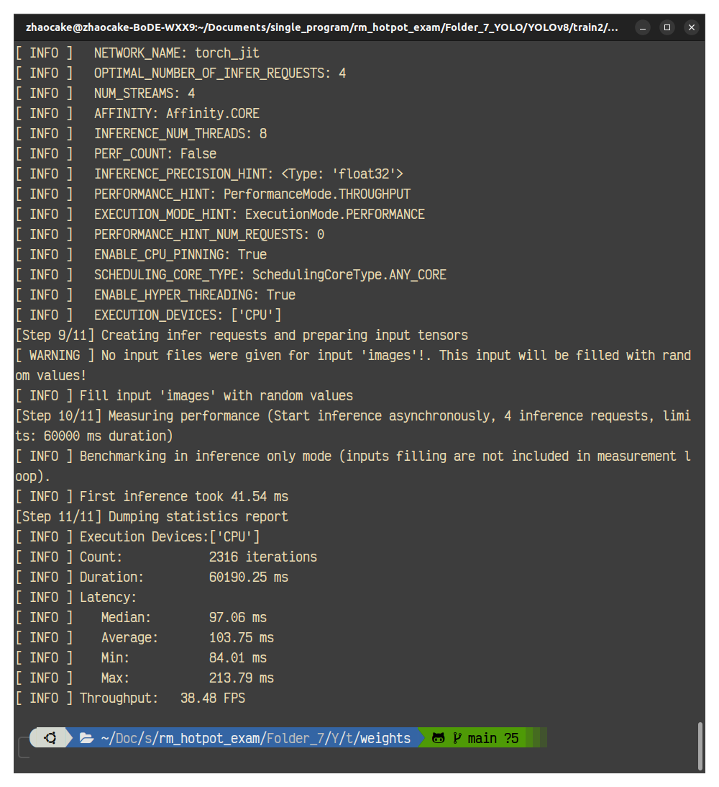
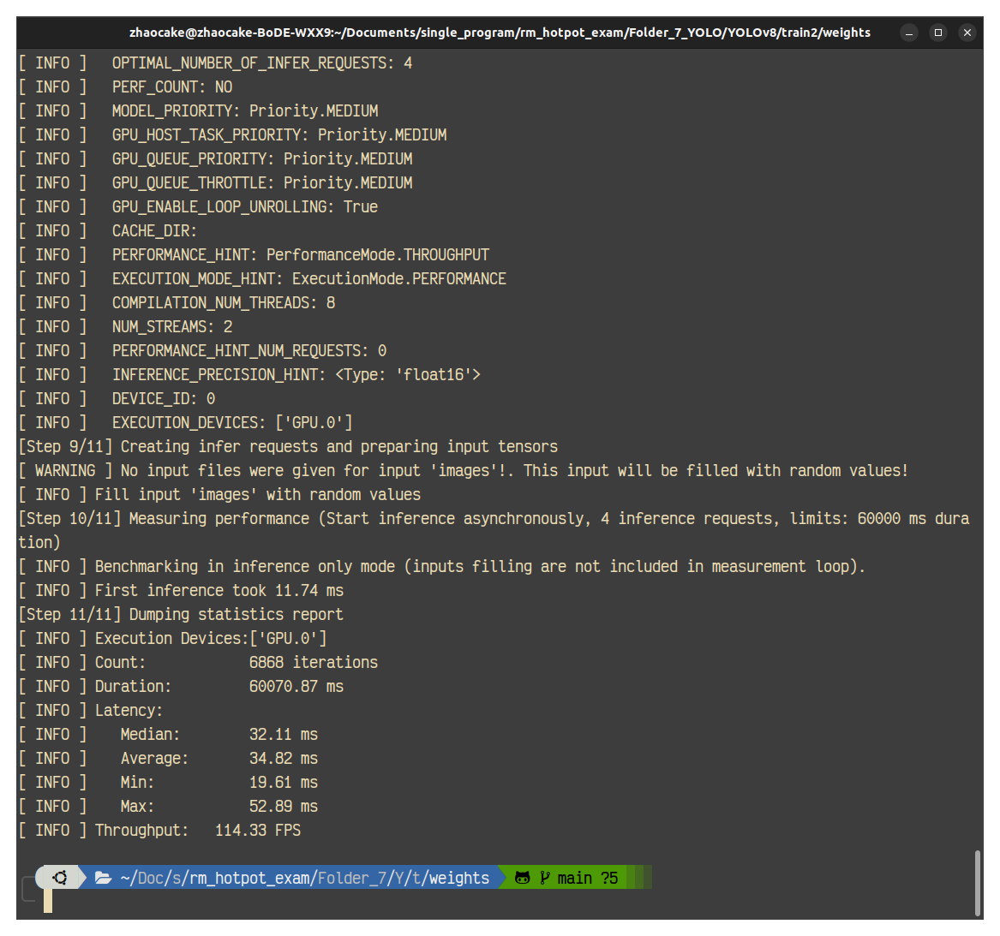
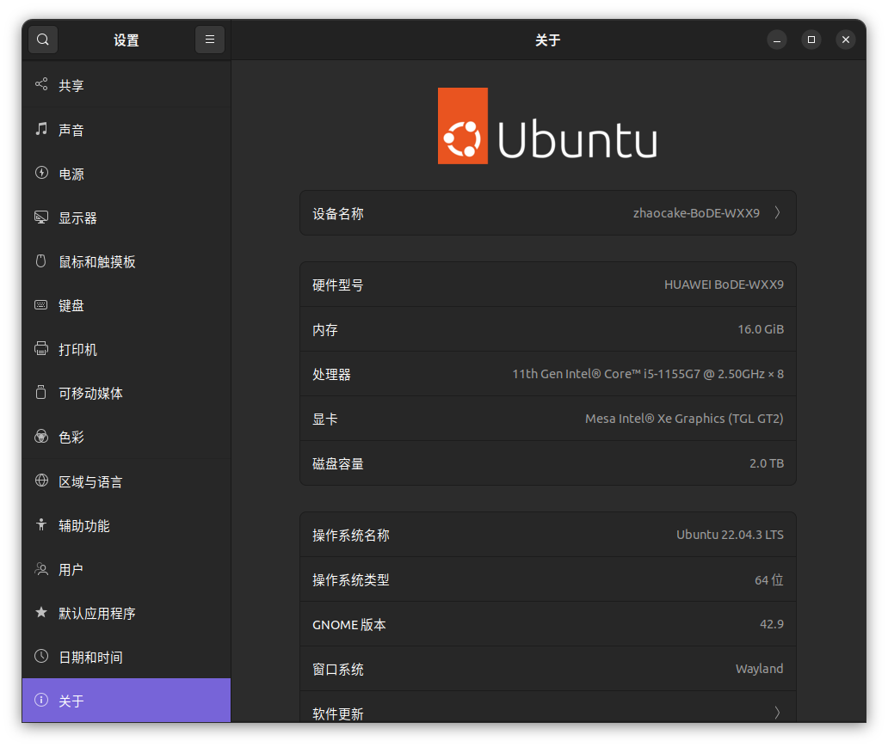
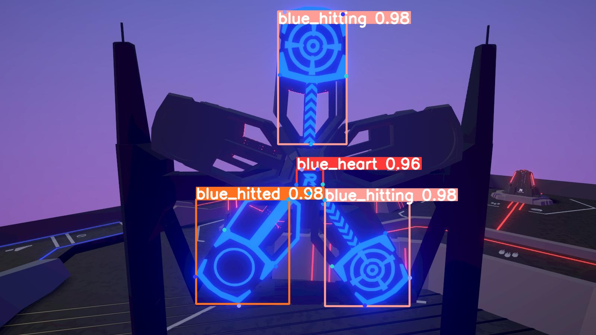
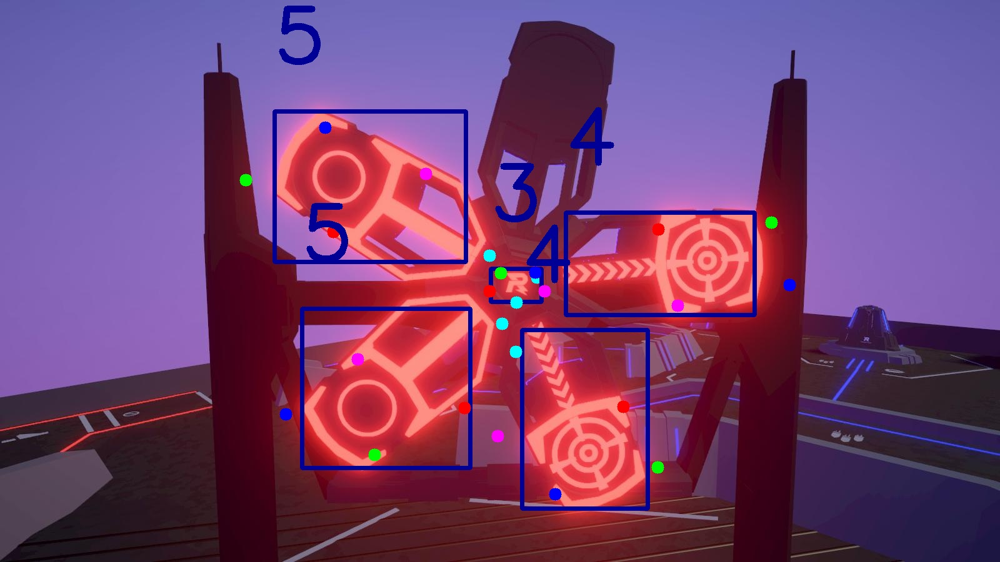
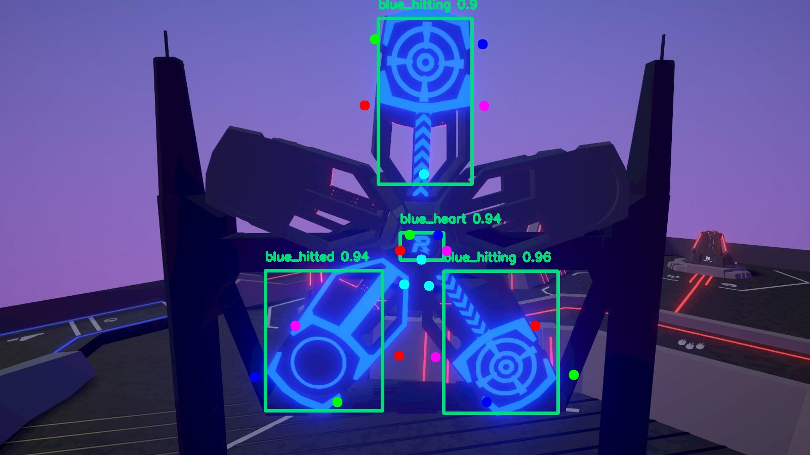

# EXTRA_Challenge for myself

## 个人说明

如果这篇文档已经被看到了，那么我姑且认为是已经有了评选结果，这个附加的部分已经不会影响到选拔，或者是选拔的前辈还没有完全得出结果，但认为这个我附加的部分不会对选拔结果产生影响。那么我就开始吹吹牛皮。

下面的自我介绍本来是为面试准备的，也就在这里用了：

> 我勤于学习，在开源学习组织datawhale中担任过组长和专业助教，获得过多次开源学习计划的完课证书；同时，我也在暑假期间参加datawhale举办的ai夏令营活动，并在第一期成功跻身前百分之十获得一等奖。

> 我勇于实践，在暑假期间我参加了科大讯飞的机器学习赛事“锂离子电池温度预测”和计算机视觉赛事“农民身份预测”，并成功进入复赛。

> 我善于探究，在作为预备队员接受指导期间，面对pt格式权重、yolov5face在使用中的一些问题，在群内讨论之后继续查找资料，厘清关键。

> 我具备开源精神，暑假期间，我给上海人工智能实验室下的浦视团队的开源视觉算法体系openmmlab的mmdet、mmaction2、mmdet3d三个算法库分别提交了3次适配纯python风格配置文件的pull requests，并获得了社区维持者的认可。目前也是一名经过OpenMMLab社区认证的Contributer。

> 我具备良好归纳总结能力，是一名csdn的博主，目前拥有超过300粉丝，超过两万访问量。

但是名头也都是些虚的，技术才是实的。

## 自找任务

我想在今天实现的任务是从~~训练到部署~~ 仅对YOLOv8训练出的模型在电脑上进行`openvino`部署的~~整个~~流程的实践。这对于我来说也是具有挑战性的。因为平常实际上并没有进行模型部署的需求（甚至于说训练在平常也是没有需求的，只是偶尔会水点算法赛练练手），所以我目前对模型部署也是没有经验的（只转过onnx的水平）。

因此即使我无法成功进入火锅战队，或者是这个附加任务并没有对评分起到任何帮助，参加火锅招新对我的帮助也是毫无疑问极大的。不参加火锅招新，有许多技术是我自己基本不会去碰的——比如ROS2和ignition gazebo仿真。包括模型的部署，我虽然一直有这个想法，但是实践却很少，半途而废做着做着就放弃的情况却很多，所以我当然希望有这样一个契机促使我去做平常不会去“耗费心力”做的事情。

~~我选择的是[OpenMMLab](https://openmmlab.com/)开源视觉算法体系。给自己找这个附加任务多少也是希望推荐一下这个算法库，不仅仅是因为我是社区贡献者而对这个算法库有好感（又拿这个说事是不是有点得意，其实我很谦逊的），更重要的是这个算法体系中覆盖众多任务和算法，其算法复现的量绝对是超过本身pytorch的量的；并且不同的任务具有相近的训练流程，这就降低了起手一个任务的门槛，我认为在robomaster这种偏应用工程的竞赛中，这样一套算法体系是很有帮助的；本身覆盖的任务类型也很广，从图像分类、目标检测、实例分割到动作识别、模型蒸馏、模型部署等，都在其算法库中有实现。~~

本来我确实是选择的OpenMMLab，但是确实时间不太合适，面对两个之前没有接触(MMRazor,MMDeploy)、一个之前用得不多(MMPose)的算法库，打算用它们一天之类从模型训练开始做完一个部署任务还是太狂了，并且是不合理的，不合理也就意味着是心态出现问题的，出现了急于求成的问题。急于求成的后果是显而易见的：一种是压根摸不到门路，一种是勉强拼凑完成了目的，但是对过程知之甚少。但是我依然十分推荐OpenMMLab开源视觉算法体系。

所以还是使用已经得到的，在`YOLOv8`文件夹下的权重来进行`openvino`部署。

## 步骤

### ~~数据集准备~~

~~使用YNU在官方开源数据集基础上的开源数据集 [RM-DATASET](https://github.com/houhongyi/RM-DATASET)~~ 但后来我还是放弃了，你知道为什么？数据集在我遇到过的里面算是中型的了，真跑下来，V100 32G单卡得跑个周多时间，时间不够，钱包也会遭到打击。按照上面说的，改成对已有的权重进行操作了。

### 使用ultralytics进行模型导出

ultralytics可以导出许多常见的模型，onnx自然不必多说，openvino也是可以使用`yolo export`命令直接导出的。

这样来看的话，确实使用yolo是最快捷和简单的方式，至少在入门难度上远小于openmmlab体系。我一个上午就上手(指大抵摸清楚怎么训练和测试以及支持哪些任务)ultralytics，但是半年才能给OpenMMLab提PR。

### 对导出模型进行评估

并且openvino的工具套件对于模型的评估也是相当方便的。


不过要在集成显卡上测试的话还需要再做一些东西。

因为缺少对显卡的驱动，所以需要安装。在官网逛来逛去一会就搞定了。



可以看到速度真的已经蛮高的了。我的配置信息如下



### 模型部署

我用来进行推理测试的资源是分别为红色与蓝色的两张大符图片

### 逐步完善的过程

先写python代码，再用cpp重写，我个人觉得这样是比较高效的。不过今天是没来得及做到的，并且使用cpp重写是可以想象的要比python写困难很多。

继续阅读官方文档，边读边理解。此时我已经大致理解了这个流程：

- 加载IR格式模型，加载的是xml文件，只要bin文件在同级目录下。然后编译这个模型。
- 编译这个模型后，他对输入是有要求的，我们可以打印`model.inputs`来获取它需求的输入张量格式。也正如文档所说，后面要对这个张量形状进行填充。`[<Output: names[images] shape[1,3,640,640] type: f32>]`
```
<bound method PyCapsule.output of <Model: 'torch_jit'
inputs[
<ConstOutput: names[images] shape[1,3,640,640] type: f32>
]
outputs[
<ConstOutput: names[output0] shape[1,20,8400] type: f32>
]>>
<bound method PyCapsule.input of <Model: 'torch_jit'
inputs[
<ConstOutput: names[images] shape[1,3,640,640] type: f32>
]
outputs[
<ConstOutput: names[output0] shape[1,20,8400] type: f32>
]>>
Model1
# 通过打印这个模型的一些属性，我确实更加了解这个转化后的模型了。
```
- 但是后面关于这种关键点检测任务的数据的处理让我麻爪了一会，然后我找到了官方的一个例子进行改造(https://github.com/openvino-book/yolov8_openvino/blob/main/yolov8_pose_ov_sync_infer.py)

- （一段时间过去）问题依然很多，但是我有了新的思路，使用onnx的例子来对照进行openvino的部署

### 结果完成

在当前文件夹中有三个目录，和一个onnx文件（出了md）。其中`src`是资源文件夹，`best_openvino_model`是openvino模型文件夹，`py_ov`是代码和结果文件夹。分别有使用yolo加载onnx,在onnxruntime中进行onnx推理、使用openvino进行图片推理与使用openvino进行视频推理四个部分，每种方式的结果都可以通过文件名看出来。

其中最主要的是视频推理。我将实时计算的结果附在了视频的右上角。幀率基本维持在40到50之间，可以想见如果不进行绘图等操作（显示和写入视频没有进行计入时间），那么幀率将会更快。我的推理设备是Intel的锐矩集成显卡，在前文已经说起过了。

好了，今日挑战也算是完成了。不能够说是满意的，但至少是收获颇丰的，这样便也够了。相信以后会再有尝试OpenMMLab的模型蒸馏和部署的契机/冲动。

### 推理结果（不包含视频）
yolo推理onnx

onnxruntime推理onnx

openvino推理


### 优化的方向

当然得说CPP，我一开始是打算做CPP的推理的，但是如前文所说，打算先使用python再根据情况用cpp重写。

目前看来，用CPP重写的阻碍有不少：
- 我在python中虽然使用onnx或者openvino运行环境进行推理，但是在数据处理等方面依然使用的是python的库。特别是NMS这里，是使用的`ultralytics`内部的实现，如果没有CPP的库提供这一功能，那么就需要自己根据NMS的源码来写这个方法，以及其他一些使用了现成实现的地方都可能有这个问题，是可以预见的比较复杂。
- 无论是从推理得到的图片还是视频，都可以看到推理结果，无论是kpt还是bbox，都相比于使用pt模型推理效果要差很多，这一部分是由于模型转化本来就会亏损一定的精度；但是经过观察，我认为更重要的、影响更大的原因可能是在对输入进行预处理或者是后处理是有不当操作，因为从视频中可以看到，kpt的变化是由歪到正再到歪的，就像它们的坐标被横向拉伸了。但是今天时间有限，也就没有去细细纠因。
