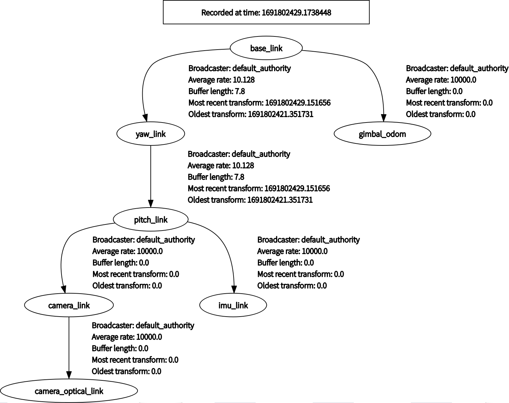
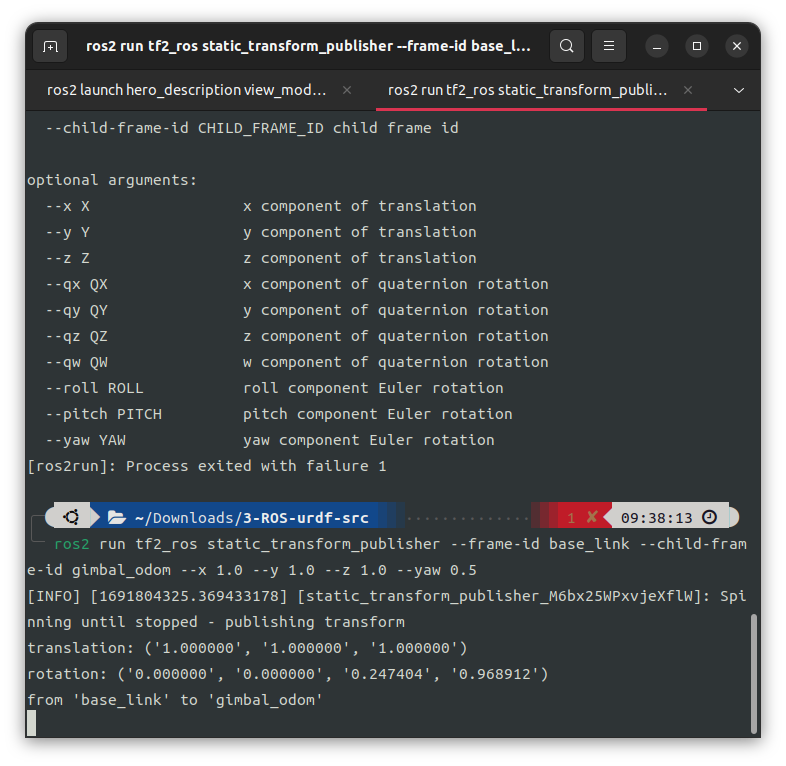
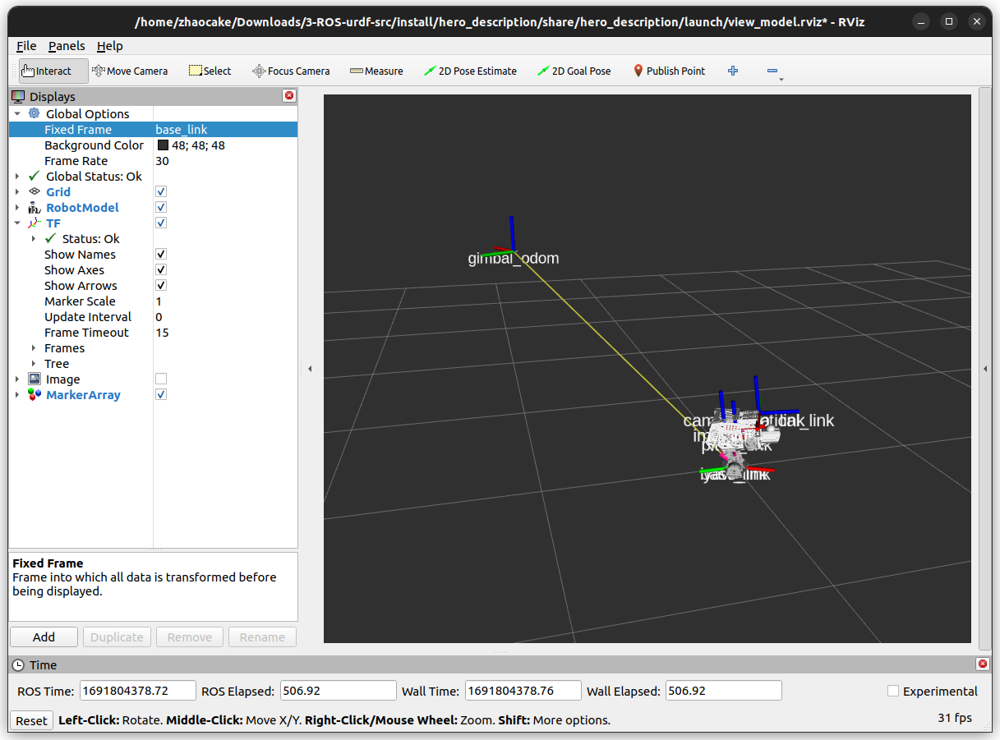
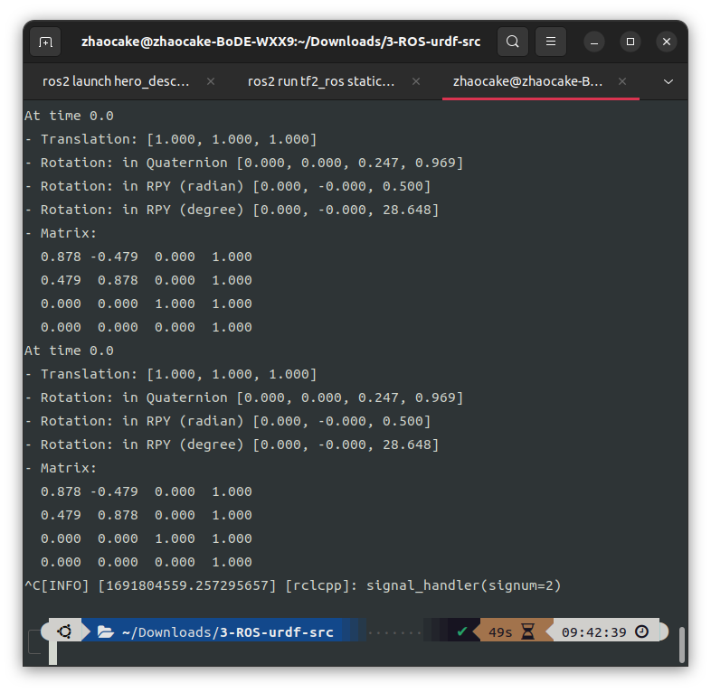
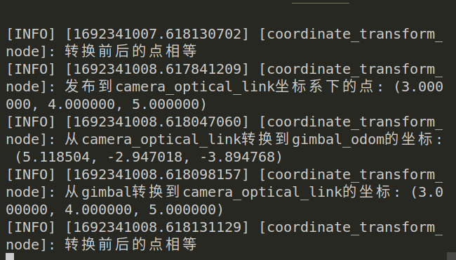

# 坐标转换部分考核

## 3.1 启动培训给定的urdf文件

截图两张已在`exam_3_1`文件夹下

## 3.2 入门tf

截图三张，分别是：

1. 命令行使用动态发布器

2. 显示效果，这里为了良好显示效果，勾选了显示名称

3. 使用tf2_echo返回坐标变换信息

截图均在文件夹`exam_3_2`中。

## 3.3 代码编写

有两道小题，其代码实现均在`exam_3_3/src/tf_exam`包的src目录中，文件名即是题号。

其中exam_3_3_1有一个视频在工作空间`exam_3_3`目录下，exam_3_3_2则有两张截图。
一张是在保留小数位数的，并发现了计算带来的误差;一张是完全完成的输出。

之所以会有一张保留小数位数的，是因为在计算中出现了一些精度造成的误差，导致坐标转换前后的点虽然日志输出的数值是一样的，但是会被判断是不一样的点。因此我这里先尝试保留四位小数，但这时发现不正确，于是才采用了`round()`函数。

